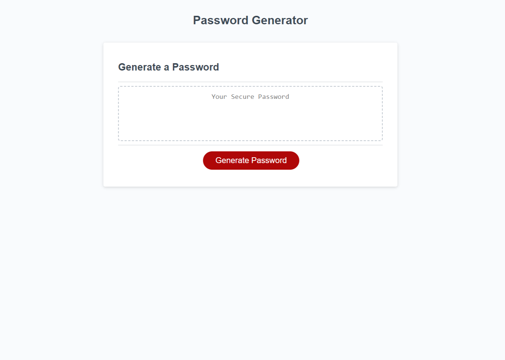

# Password-Generator

## Description

Provide a short description explaining the what, why, and how of your project. Use the following questions as a guide:

- What was your motivation?
- Why did you build this project? (Note: the answer is not "Because it was a homework assignment.")
- What problem does it solve?
- What did you learn?

To ensure realibly complicated passwords could be generated for securing information, I created a password generating script that runs in the browser. You may choose from a variety of options
allowing you to create a password that is at least 8 characters to as much as 128 characters in length, as well as including uppercase, lowercase, numeric, and special characters. Having the option of choosing a
randomly generated password makes it difficult to steal information and try to access personal data. During this project I learned some of the nuances of type conversion in JavaScript, how to call the window object
to prompt for user input, and how to generate random numbers using the built-in Math object.

## Website

## Link

https://danieltbonn.github.io/password-generator/